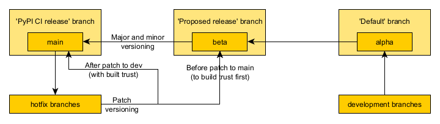

# GeoProb-Pipe
Applicatie voor het uitvoeren van probabilistische piping berekeningen. De applicatie maakt gebruik van de probabilistische 
bibliotheek van Deltares. Deze bibliotheek stuurt onder de motorkap de PTK-tool aan. 

# Contactpersonen

Het GeoProb-Pipe-team bestaat uit de volgende personen

- Sander Kapinga, S.Kapinga@wsrl.nl
- Laura van der Doef, L.vanderDoef@wshd.nl
- Chris Pitzalis, ontwikkelaar, C.Pitzalis@wsrl.nl
- Vincent Jilesen, ontwikkelaar, V.Jilesen@wshd.nl

# Installatie en quickstart
GeoProb-Pipe is beschikbaar middels de Python Package Index (https://pypi.org/project/geoprob_pipe/) voor een eenvoudige 
installatie: `pip install geoprob_pipe`. Je start vervolgens de applicatie middels het commando `geoprob_pipe`. 

# Development omgeving

Vanuit de development omgeving (kloon van repository) start je de applicatie als volgt: 
`python -m geoprob_pipe`.

Het volgende branch-schema wordt aangehouden: 

# Mee ontwikkelen
Wil je bijdragen aan de ontwikkeling van GeoProb-Pipe? Dat kan! :)

Maak een nieuwe branch aan vanuit `alpha`, ga coden en wanneer je klaar bent, maak een pull en review request aan. Zorg 
er voor dat de unit tests werken en dat je PEP8 als code stijl hanteert. We hebben enkele specifieke afspraken, zie 
tabel hieronder. Bij vragen, neem contact op met één van de ontwikkelaars. Voor PEP8, de IDE PyCharm heeft deze out of 
the box ingesteld. PyCharm is daarom de geadviseerde IDE.  

| Onderdeel        | Afspraak                                             |
|------------------|------------------------------------------------------|
| Docstring format | reStructuredText                                     |
| Line length      | 120                                                  |

# Documentatie
De live documentatie vind je [hier](https://kkpdata.github.io/GeoProb-Pipe/index.html). 

De development-documentatie genereer je vanuit een kloon van de repository en het volgende commando 
`sphinx-build -M html docs\ docs\_build`. Je vindt de documentatie daarna terug in de map 
`GeoProb-Pipe\docs\_build\html\index.html`. Dit bestand opent in de browser. Tip: voeg de documentatie toe aan je 
favorieten van de browser. 

# Disclaimer
Het gebruik van deze applicatie gebeurt volledig op eigen risico. Door deze applicatie te gebruiken, accepteert de 
gebruiker volledige verantwoordelijkheid. Het GeoProb-Pipe-team kan geen garanties geven over de werking, 
nauwkeurigheid of volledigheid van de applicatie, en kan op geen enkele manier verantwoordelijk worden gehouden voor 
eventuele fouten, schade, of verliezen die voortvloeien uit het gebruik van deze software.
