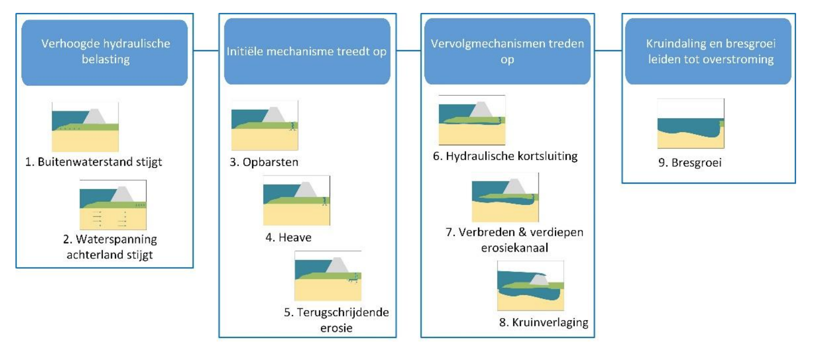

.. _rekenmethodiek:

.. TODO: Ik vind deze pagina onduidelijk ingedeeld. Kunnen we het volgende voorstel bespreken?
    Rekenmethodiek
        Berekeningsmodel
        Stijghoogtemodellen
            standaard WBI model
            Model 4a
            Numeriek stijghoogtemodel
        Modelfactoren
            relatie met beslisraamwerk: welke factoren zijn er geimplementeerd?
            Getijdezandfactor
            3D verschaling
            Gebruikersgedefinieerde factoren
  Ik zit met dezelfde vraag na het lezen. Het voelt nu nog rommelig aan. Ik doe een voorstel in de code hieronder  
  Willen we van stijghoogtemodellen een aparte rst maken?

Rekenmethodiek
==============

Deze pagina beschrijft de rekenmethodiek die `GeoProb-Pipe` hanteert voor het berekenen van de totale faalkans op piping per uittredepunt.
De rekenmethodiek legt vast hoe de fysieke processen die leiden tot opbarsten, heave en terugschrijdende erosie worden gemodelleerd, en hoe deze processen zijn vertaald naar grenstoestandsfuncties.  
De formulering van de grenstoestandsfuncties volgt de schematiseringshandleiding piping :cite:`sh_piping_2021`.
Afhankelijk van de beschikbare gegevens kan de stijghoogte worden berekend met verschillende stijghoogtemodellen, zoals het analytische model 4A of een numeriek grondwatermodel (bijvoorbeeld MORIA).  
Voor elk van deze stijghoogtemodellen is een afzonderlijke set van grenstoestandsfuncties opgesteld.  

.. contents::
   :local:
   :depth: 3

Modelbeschrijving piping
------------------------

In :numref:`faalpad-STPH` zie je een veelvoorkomend faalpad voor het faalmechanisme *piping* :cite:`HOVK_STPH_2024`. 
`GeoProb-Pipe` richt zich op het modelleren van de initiële mechanismen die leiden tot piping: opbarsten, heave en terugschrijdende erosie. 
Hierbij wordt aangenomen dat piping optreedt wanneer de deklaag opbarst, heave optreedt en er doorgaande terugschrijdende erosie plaatsvindt. 
In de schematiseringshandleiding piping :cite:`sh_piping_2021` zijn de bijbehorende grenstoestandsfuncties beschreven die in het BOI en in `GeoProb-Pipe` worden gebruikt.

.. _faalpad-STPH:

   Veelvoorkomend faalpad voor het faalmechanisme *piping* :cite:`HOVK_STPH_2024`.

.. TODO: Foutenboom toevoegen als plaatje?
.. TODO: Het kopje zegt 'Berekeningsmodellen', maar je begint vervolgens direct met één formule/model. Er is geen
    introductie (behalve de inhoudsopgave die ik net heb toegevoegd, maar die is ook te beperkt).
    #Ik (Laura) denk dat we dit 'Grenstoestandsfuncties' moeten noemen, want dat is wat we hier beschrijven.

Grenstoestandfuncties STPH
~~~~~~~~~~~~~~~~~~~~~~~~~~

Opbarsten
^^^^^^^^^^

De grenstoestandfunctie van **opbarsten** :math:`Z_{u}` is in :cite:`sh_piping_2021` als volgt gedefinieerd:

.. math::

   Z_{u} = m_{u} \cdot \Delta \phi_{c,u} - (\phi_{exit} - h_{exit})

waarbij :math:`m_{u}` de modelfactor voor opbarsten is [-]. 

De grenspotentiaal ten opzichte van maaiveldniveau :math:`\Delta \phi_{c,u}` [m] wordt bepaald door het effectieve gewicht van de deklaag onder water:

.. math::

   \Delta \phi_{c,u} = \frac{d_{deklaag} \cdot (\gamma_{sat,deklaag} - \gamma_{w})}{\gamma_{w}}

waarin:

- :math:`d_{deklaag}` de dikte van de deklaag is [m]
- :math:`\gamma_{sat}` het gemiddeld verzadigd volumegewicht van de cohesieve deklaag is [kN/m³]
- :math:`\gamma_{w}` het volumegewicht van water is [kN/m³]

De dikte van de deklaag :math:`d_{deklaag}` ter plaatse van het uittredepunt is gedefinieerd als de verticale afstand tussen het maaiveldniveau en de bovenkant van de pipinggevoelige zandlaag:

.. math::

   d_{deklaag} = mv_{exit} - top_{zandlaag}

waarin:
- :math:`mv_{exit}` maaiveldniveau ter plaatse van het uittredepunt [m+NAP]
- :math:`top_{zandlaag}` niveau bovenkant van de pipinggevoelige zandlaag [m+NAP]

De stijghoogte ter plaatse van het uittredepunt :math:`\phi_{exit}` [m+NAP] wordt volgens de schematiseringshandleiding :cite:`sh_piping_2021` beschreven door:

.. math::

   \phi_{exit} = \phi_{polder} + r_{exit} \cdot (h_{rivier} - \phi_{polder})

waarin:

- :math:`\phi_{polder}` het waterniveau in de polder [m+NAP]
- :math:`r_{exit}` de dempingsfactor ter plaatse van het uittredepunt [-]
- :math:`h_{rivier}` het waterniveau in de rivier [m+NAP]

De dempingsfactor :math:`r_{exit}` ter plaatse van het uittredepunt is afhankelijk van de locatie van het uittredepunt ten opzichte van de dijk en de geohydrologische situatie. De schematiseringshandleiding piping :cite:`sh_piping_2021` hanteert dit als een onafhankelijke invoerparameter.

:math:`h_{exit}` is de randvoorwaarde in het uittredepunt, gedefinieerd door het maximum van het polderpeil en het maaiveldniveau ter plaatse van het uittredepunt:

.. math::

   h_{exit} = max(\phi_{polder}, mv_{exit})

waarin:

- :math:`\phi_{polder}` het waterniveau in de polder [m+NAP]

Heave
^^^^^^^^^^

De grenstoestandfunctie van **heave** :math:`Z_{h}` is in :cite:`sh_piping_2021` als volgt gedefinieerd:

.. math::

   Z_{h} = m_{h} \cdot i_{i,c} - \frac{\phi_{exit} - h_{exit}}{d_{deklaag}}

waarin:

- :math:`m_{h}` de modelfactor voor heave is [-]
- :math:`i_{i,c}` de kritieke heave-gradiënt is [-]

Opgemerkt wordt dat de modelfactoren :math:`m_{u}` en :math:`m_{h}` niet zijn opgenomen in de formules van de schematiseringshandleiding piping :cite:`sh_piping_2021`, maar wel in deze implementatie zijn opgenomen om de modelonzekerheid expliciet te kunnen kwantificeren.

Terugschrijdende erosie
^^^^^^^^^^^^^^^^^^^^^^^^

De grenstoestandfunctie van **terugschrijdende erosie** :math:`Z_{p}` is in :cite:`sh_piping_2021` als volgt gedefinieerd:

.. math::

   Z_{p} = m_{p} \cdot \Delta H_{c} - \Delta h_{red}

met :math:`\Delta h_{red}` het gereduceerde verval over de deklaag [m] als:

.. math::
   
   \Delta h_{red} = h_{buitenwaterstand} - h_{exit} - r_{c,deklaag} \cdot d_{deklaag}

waarin:

- :math:`m_{p}` de modelfactor voor terugschrijdende erosie is [-]
- :math:`\Delta H_{c}` het kritieke verval over de deklaag is [m]
- :math:`h_{buitenwaterstand}` de buitenwaterstand is [m+NAP]
- :math:`h_{exit}` de randvoorwaarde in het uittredepunt is [m+NAP]
- :math:`r_{c,deklaag}` de reductieconstante van het verval over de deklaag is [-]
- :math:`d_{deklaag}` de dikte van de deklaag is [m]

Het kritieke verval over de deklaag :math:`\Delta H_{c}` is gebaseerd op het in 2011 aangepaste model van Sellmeijer.

.. math::

   \Delta H_{c} = L_{kwelweg} \cdot F_{resistance} \cdot F_{scale} \cdot F_{geometry}

met:

.. math::

   F_{resistance} = \eta \frac{\gamma_{korrel} - \gamma_{w}}{\gamma_{w}} \cdot tan(\theta)

   F_{scale} = \frac{d_{70,m}}{\sqrt[3]{L_{kwelweg} \cdot \frac{k \cdot \upsilon_{w}}{g}}} \left(\frac{d_{70}}{d_{70,m}} \right)^{0.4}

   F_{geometry} = 0.91 \left(\frac{D_{wvp}}{L_{kwelweg}} \right)^{\frac{0.28}{\left(\frac{D_{wvp}}{L_{kwelweg}} \right)^{2.8} - 1} + 0.04}

waarin:

- :math:`L_{kwelweg}` de kwelweglengte is [m], gedefinieerd als de horizontale afstand tussen het uittredepunt en een onzeker intredepunt.
- :math:`\eta` coëfficiënt van White (sleepkrachtfactor) [-]. Standaardwaarde is 0.25
- :math:`\gamma_{korrel}` volumieke dichtheid van zand [kN/m³]. Standaardwaarde is 26.0 kN/m³
- :math:`\gamma_{w}` het volumegewicht van water [kN/m³]
- :math:`\theta` de rolweerstandshoek van zandkorrels van de aangepaste Sellmeijer-rekenregel [°]. Standaardwaarde is 37°
- :math:`d_{70,m}` de referentie- :math:`d_{70}`-waarde [m]. Standaardwaarde is 2.08E-4 m
- :math:`d_{70}` de 70-percentielwaarde van de korrelverdeling van de pipinggevoelige laag [m]
- :math:`k` de Darcy-doorlatendheid van de zandlaag [m/s]
- :math:`\upsilon_{w}` de kinematische viscositeit van water [m²/s]. Standaardwaarde is 1.33E-6 m²/s bij 10°C
- :math:`g` de zwaartekrachtversnelling [m/s²]. Standaardwaarde is 9.81 m/s²
- :math:`D_{wvp}` de dikte van de watervoerende zandlaag [m]

Stijghoogtemodellen
-------------------

Binnen `GeoProb-Pipe` zijn momenteel twee methoden geïmplementeerd voor het bepalen van de stijghoogte bij het uittredepunt:  
(1) het analytische grondwatermodel 4A, en  
(2) een numeriek stijghoogtemodel in de vorm van een grid, zoals het regionale grondwatermodel MORIA.  

De rekenmethodiek is zodanig opgezet dat in de toekomst ook andere stijghoogtemodellen kunnen worden toegevoegd.

Analytische stijghoogtemodel 4A
~~~~~~~~~~~~~~~~~~~~~~~~~~~~~~~~~

De drijvende kracht achter terugschrijdende erosie is grondwaterstroming. Door het analytische grondwatermodel 4A van :cite:`trw_2004` toe te passen, kan de respons :math:`r_{exit}` in het uittredepunt beschreven worden als functie van de locatie in het dwarspofiel :math:`x_{exit}` [m] en de geohydrologische parameters van model 4A. 
Uitleg over het model 4A is te vinden in de :ref:`stationair-model`. De repons in het uittredepunt wordt dan:

.. math::

   r_{exit}(x) = f(x_{exit}, L_1, L_2, L_3, c_{voorland}, c_{achterland}, k, D_{wvp})

Geometrische parameters
^^^^^^^^^^^^^^^^^^^^^^^^
Geometrische parameters :math:`L_1` en :math:`L_2` zijn omgeschreven naar afstanden ten opzichte van het uittredepunt:

.. math::

   L_1 = L_{intrede} - L_{but}

   L_2 = L_{but} - L_{bit}

waarin:

- :math:`L_{intrede}` de afstand van het uittredepunt tot een geometrische intredelijn [m]
- :math:`L_{but}` de afstand van het uittredepunt tot de buitenteen [m]
- :math:`L_{bit}` de afstand van het uittredepunt tot de binnenteen [m]
- :math:`L_3` de achterlandlengte [m]
- :math:`x_{exit}` de afstand van het uittredepunt tot de binnenteen [m]. De aanname is dat uittredepunten altijd binnendijks van een (denkbeeldige) binnenteen liggen.
- :math:`c_{voorland}` de weerstand van de deklaag in het voorland [dag]
- :math:`c_{achterland}` dde weerstand van de deklaag in het achterland [dag]

Effectieve voorlandlengte
^^^^^^^^^^^^^^^^^^^^^^^^^^  
De kwelweglengte :math:`L_{kwelweg}` maakt conform de schematiseringshandleiding piping :cite:`sh_piping_2021` gebruik van het principe van de effectieve voorlandlengte. 

.. math::

   L_{kwelweg} = L_{but} + L_{eff,voorland}

   L_{eff,voorland} = \lambda_{1} \cdot tanh(\frac{L_1}{\lambda_{1}})

   \lambda_{1} = \sqrt{c_{voorland} \cdot k \cdot D_{wvp}}

waarin:

- :math:`L_{eff,voorland}` de effectieve voorlandlengte is [m]
- :math:`\lambda_{1}` de spreidingslengte van het voorland is [m]

Overzicht parameters model 4A
^^^^^^^^^^^^^^^^^^^^^^^^^^^^^^

Het berekeningsmodel met het analytische grondwatermodel 4A kent de volgende invoerparameters:

.. list-table:: Invoerparameters berekeningsmodel met model 4A
   :widths: 20 60 20 
   :header-rows: 1

   * - Variable
     - Omschrijving
     - Verdeling/Constante
   * - :math:`h_{buitenwaterstand}`
     - Buitenwaterstand [m+NAP]
     - CDF
   * - :math:`\phi_{polder}`
     - Waterniveau in de polder [m+NAP]
     - deterministisch
   * - :math:`mv_{exit}`
     - Maaiveldniveau ter plaatse van uittredepunt [m+NAP]
     - deterministisch
   * - :math:`r_{c,deklaag}`
     - Reductieconstante van het verval over de deklaag [-]
     - lognormaal
   * - :math:`L_{bit}`
     - Afstand van het uittredepunt tot de binnenteen [m]
     - deterministisch
   * - :math:`L_{but}`
     - Afstand van het uittredepunt tot de buitenteen [m]
     - deterministisch
   * - :math:`L_{intrede}`
     - Afstand van het uittredepunt tot geometrische intredelijn [m]
     - deterministisch
   * - :math:`L_{3}`
     - Achterlandlengte [m]
     - deterministisch
   * - :math:`top_{zandlaag}`
     - niveau bovenkant van de pipinggevoelige zandlaag [m+NAP]
     - normaal
   * - :math:`c_{voorland}`
     - Weerstand van de deklaag in het voorland [dag]
     - lognormaal
   * - :math:`c_{achterland}`
     - Weerstand van de deklaag in het achterland [dag]
     - lognormaal
   * - :math:`D_{wvp}`
     - Dikte van de watervoerende zandlaag [m]
     - lognormaal
   * - :math:`kD_{wvp}`
     - Transmissiviteit van het watervoerende pakket [m²/dag]
     - lognormaal
   * - :math:`d_{70}`
     - 70-percentielwaarde van de korrelverdeling van de pipinggevoelige laag [m]
     - lognormaal
   * - :math:`\gamma_{sat,deklaag}`
     - Gemiddeld verzadigd volumegewicht deklaag [kN/m³]
     - lognormaal, shift = 10.0
   * - :math:`i_{i,c}`
     - Kritieke heave gradiënt [-]
     - lognormaal
   * - :math:`d_{70,m}`
     - Referentiewaarde voor de :math:`d_{70}` [m]
     - 2.08E-4 m
   * - :math:`\upsilon_{w}`
     - Kinematische viscositeit van water [m²/s]
     - 1.33E-6 m²/s bij 10°C
   * - :math:`\eta`
     - Coëfficiënt van White (sleepkrachtfactor) [-]
     - 0.25
   * - :math:`\theta`
     - Rolweerstandshoek van zandkorrels van de aangepaste Sellmeijer rekenregel [°]
     - 37°    
   * - :math:`g`
     - Zwaartekrachtversnelling [m/s²]
     - 9.81 m/s²
   * - :math:`\gamma_{korrel}`
     - Volumieke dichtheid zand [kN/m³]
     - 26.0 kN/m³
   * - :math:`\gamma_{w}`
     - Volumegewicht van water [kN/m³]
     - 9.81 kN/m³
   * - :math:`m_{u}`
     - Modelfactor opbarsten [-]
     - normaal
   * - :math:`m_{h}`
     - Modelfactor heave [-]
     - normaal
   * - :math:`m_{p}`
     - Modelfactor terugschrijdende erosie [-]
     - normaal

Numerieke stijghoogtemodellen
~~~~~~~~~~~~~~~~~~~~~~~~~~~~~~~~~

In plaats van het analytische grondwatermodel 4A kan ook een ander (numeriek) stijghoogtemodel worden gebruikt om de respons in het uittredepunt te bepalen. In het geval van Waterschap Rivierenland is dat het regionale grondwaterstromingsmodel MORIA. Informatie van numerieke modellen is vaak beschikbaar in de vorm van een grid. Per uittredepunt kunnen de geohydrologische parameters worden uitgelezen uit het grid. De benodigde variabelen zijn:

- :math:`\phi_{gemiddeld}(x,y)` een grid met het gemiddelde grondwaterstandniveau bij gemiddelde rivierwaterstand [m+NAP]
- :math:`h_{gemiddeld}` de gemiddelde rivierwaterstand nabij het uittredepunt [m+NAP]
- :math:`r_{exit}(x,y)` een grid met de respons in het uittredepunt [-]
- :math:`\lambda_{1}` de spreidingslengte van het voorland [m]

De stijghoogte in het uittredepunt wordt dan:

.. math::

   \phi_{exit}(x,y) = \phi_{gemiddeld}(x,y) + r_{exit}(x,y) \cdot (h_{buitenwaterstand} - h_{gemiddeld})

   L_{eff,voorland} = \lambda_{1} \cdot tanh(\frac{L_1}{\lambda_{1}})

   L_{kwelweg} = L_{but} + L_{eff,voorland}

Bespreken: moeten we nog een modelfactor :math:`m_{gw}` voor het stijghoogtemodel toevoegen.

Grenstoestandfuncties numeriek stijghoogtemodel
^^^^^^^^^^^^^^^^^^^^^^^^^^^^^^^^^^^^^^^^^^^^^^^^
De formules van de grenstoestandsfuncties zijn nu als volgt:

Grenstoestandfunctie opbarsten:

.. math::

   Z_{u} = m_{u} \cdot \Delta \phi_{c,u} - (\phi_{exit}(x,y) - h_{exit})

Grenstoestandfunctie heave:

.. math::

   Z_{h} = m_{h} \cdot i_{i,c} - \frac{\phi_{exit}(x,y) - h_{exit}}{d_{deklaag}}

Grenstoestandfunctie terugschrijdende erosie:

.. math::

   Z_{p} = m_{p} \cdot \Delta H_{c} - \Delta h_{red}

   \Delta h_{red} = h_{buitenwaterstand} - h_{exit} - r_{c,deklaag} \cdot d_{deklaag}

   L_{kwelweg} = L_{but} + L_{eff,voorland}

   L_{eff,voorland} = \lambda_{1} \cdot tanh(\frac{L_1}{\lambda_{1}})

   \lambda_{1} = \sqrt{c_{voorland} \cdot k \cdot D_{wvp}}

Correlatie tussen variabelen
-----------------------------------------------------------

De beschrijving van het geohydrologische systeem met deze variabelen betekent ook dat de onderlinge correlatie van de variabelen apart moet worden gedefinieerd. Dit betreft met name de correlatie tussen de spreidingslengte van het voorland :math:`\lambda_{1}` en de transmissiviteit van het watervoerende zandpakket :math:`kD` en in mindere mate de correlatie tussen de respons in het uittredepunt :math:`r_{exit}` en de transmissiviteit van het watervoerende zandpakket :math:`kD`. In het model 4A zijn deze correlaties modelmatig beschreven.

In het geval van een numeriek stijghoogtemodel is de correlatie tussen de spreidingslengte van het voorland en de transmissiviteit van het watervoerende zandpakket plaatsafhankelijk en wordt beschreven door het geohydrologische model. 

Om een inschatting te doen van de correlatie tussen deze variabelen wordt een beperkte set van modelberekeningen uitgevoerd waarbij de transmissiviteit van het watervoerende pakket en de weerstand van het voorland wordt gevarieerd. 
Voor elke berekening uit deze set wordt de spreidingslengte van het voorland afgeleid.
Gebruikelijk is het om daarbij per variabele 3 scenario's te hanteren (gemiddeld, -1.64 * sigma, +1.64 * sigma).
Voor 2 variabelen resulteert dit in 9 modelberekeningen. 

Uit deze modelberekeningen wordt de gewogen correlatie tussen de transmissiviteit van het watervoerende pakket en de spreidingslengte van het voorland bepaald. Deze correlatie wordt vervolgens gebruikt in de probabilistische analyse.

Op basis van het model 4A is de correlatie tussen de transmissiviteit van het watervoerende pakket en de spreidingslengte van het voorland ongeveer 0.7, afhankelijk van de gekozen spreiding.
.. TODO: over de correlatie tussen variabele twijfel ik of dit bij de twee losse stijghoogte mogelijkheden opgeslpitst moet worden of dat dit een apart kopje moet zijn. Wat vinden jullie?
