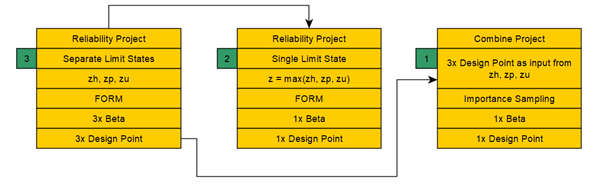
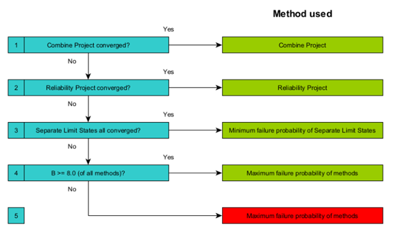

Stap 0: Scenarioberekening
===========================
Piping treedt op als opbarsten én heave én terugschrijdende erosie optreedt. 
Deze mechanismen zijn beschreven door grenstoestandfuncties (``Zu``, ``Zh`` en ``Zp``). 
Probabilistische rekentechnieken zoeken naar de combinatie van mogelijke realisaties 
van onzekere parameters waarbij de kans op falen het grootst is. Dit is voor elke 
grenstoestandfunctie een andere combinatie. Omdat we in de analyse van de resultaten 
graag de invloedsfactoren van de afzonderlijke grenstoestandfuncties willen beschouwen, 
niet elke rekentechniek convergeert naar een betrouwbare oplossing en een herleidbare 
oplossing vereist is, is het volgende rekenprotocol bedacht.

Rekenprotocol bepalen bèta
----------------------------

Per scenarioberekening en gegeven een set van (onzekere) invoervariabelen, worden 
altijd de volgende drie rekenblokken uitgevoerd. Deze blokken verschillen in 
probabilistische methode en in benodigde invoer.

Het resultaat van de (gecombineerde) kans op piping wordt bepaald door convergentie 
van deze rekenblokken.

Reliability Project (RP) – afzonderlijke limit states (geelblok links)
~~~~~~~~~~~~~~~~~~~~~~~~~~~~~~~~~~~~~~~~~~~~~~~~~~~~~~~~~~~~~~~~~~~~~~~~~~~

Het Reliability Project wordt altijd uitgevoerd, omdat dit de input levert voor de 
overige methoden. In dit blok worden de drie afzonderlijke limit state functies 
(``Zu``, ``Zh``, ``Zp``) onafhankelijk van elkaar opgelost met FORM (default). Hierbij worden dezelfde stochasten en kansverdelingen gebruikt, maar 
voor iedere limit state worden zelfstandige trekkingen uitgevoerd.

Dit resulteert in:

- 3 × β‑waarde  
- 3 × α‑vector  
- 3 × designpoint  

(dus één set per limit state).

Reliability Project (RP) – samengestelde limit state (geelblok midden)
~~~~~~~~~~~~~~~~~~~~~~~~~~~~~~~~~~~~~~~~~~~~~~~~~~~~~~~~~~~~~~~~~~~~~~~~~~~

Het tweede rekenblok maakt opnieuw gebruik van het Reliability Project, maar nu met 
één samengestelde limit state: ``Z = max(Zu, Zh, Zp)``.

Dezelfde stochasten, verdelingen en probabilistische methode als voorgaand wordt toegepast. 
Alle deelmechanismen gecombineerd tot één samengestelde limit state die wordt opgelost 
en leidt tot:

- 1 × β‑waarde  
- 1 × designpoint  

voor de betreffende scenarioberekening. De invloedsfactoren van de afzonderlijke 
grenstoestandfuncties zijn in dit geval niet beschikbaar.

Combine Project (CP) – importance sampling (geelblok rechts)
~~~~~~~~~~~~~~~~~~~~~~~~~~~~~~~~~~~~~~~~~~~~~~~~~~~~~~~~~~~~~~~~~~~~~~~~~~~

In het Combine Project worden de drie designpoints uit het eerste Reliability Project 
(de afzonderlijke limit states) als input gebruikt. Op basis hiervan wordt met 
importance sampling (default) een gecombineerde β‑waarde bepaald.

Alle drie de rekenblokken leveren een betrouwbaarheidsindex (β), al is deze door het 
niet bereiken van het convergentiecriterium niet altijd betrouwbaar. Om een herleidbaar 
en betrouwbaar resultaat te bereiken, geeft onderstaand protocol (groene blokjes in 
figuur 1 en de flowchart in figuur 2) aan welk antwoord GeoProb‑Pipe als resultaat geeft. 

Rekenprotocol bij niet-convergerende berekeningen
--------------------------------------------------

De figuur toont de volgorde waarin de methoden worden beoordeeld. 

De logica is als volgt:

Stap 1 – Combine Project geconvergeerd?
    → Gebruik het resultaat uit het Combine Project. Voorwaarde is dat de afzonderlijke 
    grenstoestandfuncties ook geconvergeerd zijn  
    (snelste methode én geldig indien geconvergeerd).

Stap 2 – Reliability Project (samengestelde limit state) geconvergeerd?
    → Gebruik de β‑waarde uit de gecombineerde limit state.

Stap 3 – Alle afzonderlijke limit states geconvergeerd?
    → Gebruik het minimum van de drie β‑waarden.  
    Dit is een conservatieve benadering.

Stap 4 – Zijn één of meer afzonderlijke limit states niet geconvergeerd, maar zijn alle β‑waarden > 8?
    → Gebruik de minimum β‑waarde van de drie.  
    Het resultaat is dan zo positief dat verdere verfijning niet zinvol is.

Stap 5 – Geen methode convergeert én β < 8
    → Controleer de invoervariabelen en verfijn zo nodig de rekeninstellingen 
    (bijvoorbeeld FORM‑instellingen of importance‑samplingparameters).  
    Wisselen van probabilistische methode is in de gebruikersinterface momenteel 
    nog niet mogelijk.