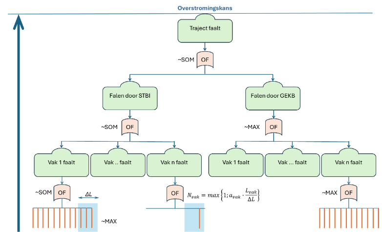

Stap 2: Uittredepunt → Vak
--------------------------

In deze stap worden de uittredepuntfaalkansen uit Stap 1 gecombineerd tot één faalkans per vak.

Een dijkvak bevat meerdere uittredepunten waar piping kan initiëren.
De faalkans per vak volgt uit het combineren van deze bijdragen,
rekening houdend met het lengte-effect.

.. _fig-bottom-up-traject:

   Schematische weergave van bottom-up assembleren van traject naar
   vakniveau. De trajectfaalkans wordt opgebouwd uit vakkansen (SOM/MAX),
   waarbij op vakniveau het lengte-effect wordt gemodelleerd via
   :math:`N_{\mathrm{vak}}`.

:numref:`fig-bottom-up-traject` laat zien hoe faalkansen op hoger schaalniveau
worden opgebouwd uit onderliggende elementen en waar het lengte-effect
in de assemblage wordt toegepast.

Lengte-effect en opschaling
~~~~~~~~~~~~~~~~~~~~~~~~~~~

Het aantal effectieve, onafhankelijke bijdragen binnen een vak wordt
benaderd met:

.. math::

   N_{\mathrm{vak}} =
   \max\left(
       1,\;
       a_{\mathrm{vak}} \frac{L_{\mathrm{vak}}}{\Delta L}
   \right)

waarbij:

- :math:`L_{\mathrm{vak}}` de lengte van het vak is;
- :math:`\Delta L` de equivalente onafhankelijke lengte voor STPH;
- :math:`a_{\mathrm{vak}}` de mechanismegevoelige fractie van het vak.

.. TODO: Waar kan men Delta L en alpha vandaan halen? Bronvermelding? Of vermelden of wij defaults gebruiken?

Bepaling van de faalkans per vak
~~~~~~~~~~~~~~~~~~~~~~~~~~~~~~~~

De faalkans van het vak wordt bepaald met:

.. math::

   P_{f,\mathrm{vak}} =
   N_{\mathrm{vak}} \cdot P_{f,\mathrm{uittrede,rep}}

Hierin is :math:`P_{f,\mathrm{uittrede,rep}}` de representatieve faalkans per uittredepunt binnen het vak.

.. TODO: Hoe is deze representatieve faalkans anders dan de faalkans van een uittredepunt uit stap 1? Dat wordt hier
 niet duidelijk.

De ondergrens van de vakkans wordt bepaald door de grootste individuele uittredepuntfaalkans; de bovengrens volgt uit
de SOM-benadering.

.. TODO: Waar zijn deze onder- en bovengrens van belang? Is dit in de volgende stap? Of is dit ter indicatie? Voelt nu
 alsof we een statistische weetje delen, waar verder niks mee wordt gedaan.

In een vervolgstap kan :math:`P_{f,\mathrm{uittrede,rep}}` worden afgeleid uit DSN-resultaten, bijvoorbeeld via een
moving window-benadering of via een representatieve discretisatie gekoppeld aan :math:`\Delta L`.

.. TODO: DSN-resultaten is een term die nog niet eerder werd gebruikt. Wat wordt hiermee bedoeld? Doorsnede, indien ja,
 doorsnede werd eerder juist onderuit gehaald als term die we niet meer gebruiken; we werken nu met
 uittredepunt-locaties.

 .. TODO: 'In een vervolgstap... moving window... of representatieve discretisatie...'. Het is niet duidelijk wat deze
 dingen inhouden, of welke vervolgstap bedoeld wordt. Dit hoofdstuk wordt genummerd in stappen, maar 'een stap' lijkt
 tegen te spreken dat het om stap 3 gaat. Deze alinea heeft verduidelijking nodig.